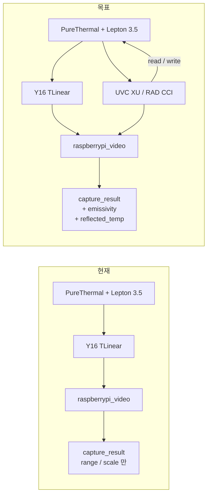
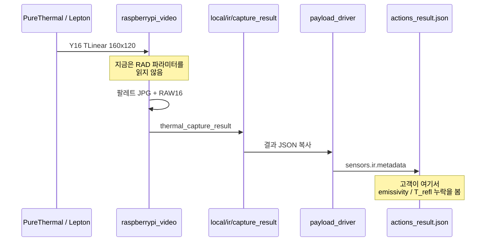
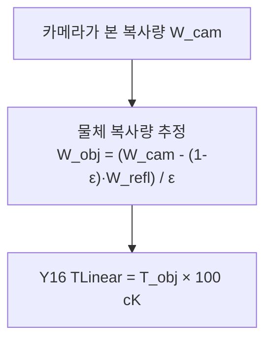
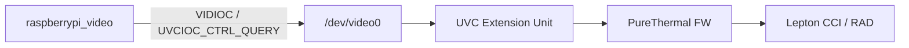
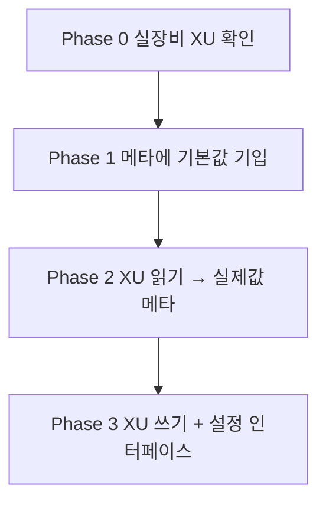
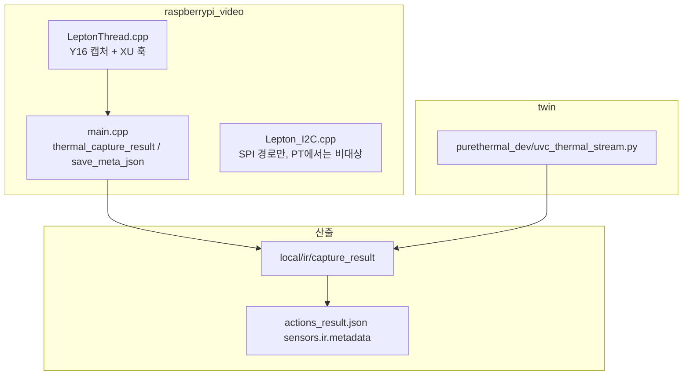

# IR 방사율 / 반사온도 — 추가 개발 계획

> 상태: **미구현 (계획만)**  
> 대상: PureThermal 3.0 + FLIR Lepton 3.5, Y16 TLinear  
> 구현하지 말 것. 착수 시 이 문서를 기준으로 한다.

고객 질문: IR 메타데이터에 **방사율(emissivity)** 과 **반사 온도(reflected temperature)** 가 없다.  
현재 앱은 이 값을 설정·기록하지 않으며, Lepton RAD 공장 기본값이 TLinear 픽셀에 이미 들어가 있다.

---

## 1. 현재 vs 목표



| 구분 | 현재 | 목표 |
|---|---|---|
| 방사율 설정 | 안 함 (카메라 기본값) | UVC XU로 읽기 / 쓰기 |
| 반사온도 설정 | 안 함 (카메라 기본값) | UVC XU로 읽기 / 쓰기 |
| IR 메타 | `range_*`, `scale_*`, `raw_unit` | 위 항목 + 출처(`factory_default` / `uvc_xu_read`) |
| JPG | 팔레트 시각화 (FLIR FFF 아님) | 동일. 정량은 RAW16 |

---

## 2. 데이터 경로 (캡쳐 → 고객 메타)



Twin 구현: `purethermal_dev/uvc_thermal_stream.py` 도 같은 `thermal_capture_result` 스키마를 쓴다.  
메타 필드를 넣을 때 **양쪽을 같이** 맞출 것.

---

## 3. 물리 / 기본값

Lepton 3.5 TLinear는 카메라 내부에서 아래 보정을 적용한 **장면 온도(cK)** 를 낸다.



모듈 리셋 기본값 (호스트가 덮어쓰지 않을 때):

| RAD 항목 | 기본 레지스터 | 의미 |
|---|---|---|
| Object Emissivity | `8192` | **ε = 1.000** (스케일 8192 = 1.0) |
| TReflected / TBkg | `29515` cK | **22.0 °C** |
| Window / Atmosphere τ | `8192` | 1.0 (대기·윈도우 보정 없음) |
| TLinear | Enable, 0.01 K | Y16 = Kelvin × 100 |

**중요:** ε = 1.0 이면 `(1-ε)·W_refl = 0` 이라 **반사온도 보정 효과는 0** 이다.  
ε 를 1 미만으로 써야 T_refl 이 픽셀 값에 영향을 준다.  
ε 를 바꾸면 **이후 Y16 픽셀 자체가 바뀐다.** 메타만 고치는 것과 카메라 설정 변경은 별개다.

온도 변환 (이미 사용 중):

```text
T_C = (raw_u16 - 27315) / 100
```

---

## 4. PureThermal에서 값을 읽고 쓰는 경로

호스트 I2C로 Lepton CCI를 직접 열지 않는다. PureThermal 펌웨어가 **UVC Extension Unit** 으로 CCI를 노출한다.



착수 전 실장비 확인:

```bash
v4l2-ctl -d /dev/video0 --all
v4l2-ctl -d /dev/video0 --list-ctrls
# GetThermal pt*.xml / uvcdynctrl 로 XU selector 목록 확인
```

참고 (GetThermal / Lepton SDK):

- `LEP_CID_RAD_OBJECT_EMISSIVITY` — 1..8192
- `LEP_CID_RAD_TLINEAR_ENABLE` / `LEP_CID_RAD_TLINEAR_RESOLUTION`
- `LEP_CID_RAD_FLUX_LINEAR_PARAMS` — `sceneEmissivity`, `TBkgK`, `TReflK`, `tauAtm`, `TAtmK`, …

이 레포의 `leptonSDKEmb32PUB` 에는 **`LEPTON_RAD` 가 없다.**  
RAD 읽기/쓰기는 SDK를 추가하거나, GetThermal XU selector를 직접 ioctl 하는 쪽으로 간다.

현재 코드가 하는 일:

- `LeptonThread.cpp`: Y16 `VIDIOC_S_FMT` / mmap 캡처만
- `Lepton_I2C.cpp`: FFC·리부트만 (SPI breakout용, PureThermal Y16 경로에서는 사실상 미사용)

---

## 5. 넣을 메타 필드 (안)

`thermal_capture_result` 와 `save_meta_json()` 에 추가하고, 그대로 `sensors.ir.metadata` 로 나가게 한다.

```json
{
  "raw_unit": "centi_kelvin",
  "tlinear_enable": true,
  "tlinear_resolution_ck": 1,

  "emissivity": 1.0,
  "emissivity_raw": 8192,

  "reflected_temp_c": 22.0,
  "reflected_temp_ck": 29515,

  "rad_source": "factory_default"
}
```

`rad_source` 값:

| 값 | 의미 |
|---|---|
| `factory_default` | 카메라를 안 읽고 문서상 기본값을 기입 (Phase 1) |
| `uvc_xu_read` | 캡쳐 시점 XU에서 실제 읽음 (Phase 2) |
| `uvc_xu_set` | 이번 세션에서 호스트가 설정한 값 (Phase 3) |

선택(후속): `atm_temp_c`, `atm_transmission`, `window_temp_c`, `window_transmission` — 고객이 대기/윈도우까지 물으면 같은 RAD struct에서 확장.

JPG는 FLIR radiometric JPEG가 아니다. FLIR Tools용 FFF 임베드는 **이 범위에 넣지 않는다.** 정량은 RAW16 + JSON 메타.

---

## 6. 단계



### Phase 0 — 확인만

- PureThermal 3 + 사용 중 펌웨어에서 RAD XU가 보이는지
- selector / GUID / 단위 (8192 vs float, cK vs K)
- TLinear가 실제로 켜져 있는지 (Y16이 이미 cK로 보이는지만으로 추정 중)

### Phase 1 — 메타만 (카메라 미변경)

- `capture_result` / `meta.json` 에 기본값 필드 추가
- `rad_source: "factory_default"`
- 고객 “누락” 클레임은 이 단계로 해소 가능
- **픽셀 값은 변하지 않음**

### Phase 2 — 읽기

- 캡쳐 직전/직후 XU GET
- 실패 시 `factory_default` 로 fallback + `rad_read_error`
- `raspberrypi_video` 와 `uvc_thermal_stream.py` 동일 키

### Phase 3 — 쓰기 / 조정

설정 채널 (하나만 먼저):

1. 환경변수: `IR_EMISSIVITY=0.95`, `IR_REFLECTED_TEMP_C=22`
2. 또는 MQTT `local/ir/cmd` 에 `set_rad` (캡쳐와 분리 권장)

기동 시 1회 SET 후 GET으로 확인해서 메타에 `uvc_xu_set` 기록.

---

## 7. 손댈 파일



| 파일 | 역할 |
|---|---|
| `main.cpp` | 메타 JSON 스키마 |
| `LeptonThread.cpp` / `.h` | V4L2 장치에서 XU GET/SET |
| `purethermal_dev/uvc_thermal_stream.py` | 동일 스키마 유지 |
| `README.md` | 필드 문서화 (구현 시) |

`payload_driver` 는 `capture_result` 를 거의 그대로 `sensors.ir.metadata` 에 넣는다. 필드만 추가하면 northbound에도 실린다. 별도 RMS 스키마 고정이 있으면 그쪽 스펙도 같이 갱신.

---

## 8. 구현 시 주의

- **메타 기입 ≠ 보정 적용.** 기본값을 JSON에만 적어도 Y16은 그대로다.
- **ε 변경 = 온도 스케일 변경.** 팔레트 `scale_min/max` (°C) 해석이 어긋날 수 있다.
- 스트림 중에 XU SET 하면 프레임 드롭/포맷 리셋가 날 수 있다. 기동 시 1회가 안전.
- 고객이 FLIR Tools 메타를 기대하면, 우리 JPG에는 원래 없다. RAW16 + JSON으로 안내.
- 이 문서는 계획이다. Phase 0 실측 전 selector ID를 코드에 하드코딩하지 말 것.

---

## 9. 고객 회신 포인트 (구현 전에도 사용 가능)

- 지금은 호스트가 방사율·반사온도를 지정하지 않아 **Lepton 기본값(ε=1.00, T_refl=22 °C)** 이 쓰인다.
- ε=1.00 이라 반사온도 보정은 사실상 적용되지 않는다.
- IR 메타에 해당 키가 없는 것은 미기록이다. JSON에 넣고, 필요하면 PureThermal UVC XU로 읽기/조정이 가능하다.
- JPG는 의사색채, 온도 원본은 `ir_*_raw16.raw` (`centi_kelvin`) 이다.
